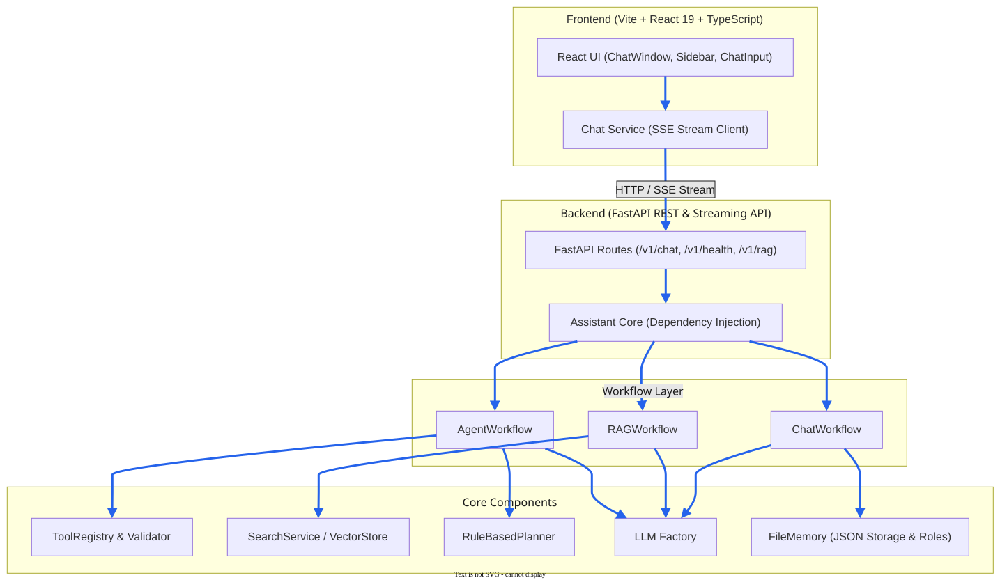

# Architecture Overview

## Overview

AI Assistant is a production-oriented, provider-independent AI assistant framework built around clean architecture principles and organized as a monorepo with a FastAPI backend and a Vite + React frontend.

The system is designed to support multiple operational workflows—such as standard conversational chat, Retrieval-Augmented Generation (RAG), and autonomous multi-step agent execution—while remaining highly modular and extensible.

All core components communicate exclusively through clean abstractions, allowing vector stores, memory backends, LLM providers, and other infrastructure components to be replaced without affecting the rest of the application.

---

## Design Principles

- **Modular Architecture**: Decoupled components with single, well-defined responsibilities.
- **Provider Independence**: Core domain and workflow layers depend only on abstract interfaces (`BaseLLM`, `BaseMemory`, `BaseRetriever`, `BaseTool`, `BasePlanner`).
- **Dependency Injection**: Dependencies are passed into constructors or route handlers rather than hardcoded.
- **Full-Stack End-to-End Execution**: Seamless integration between the React UI streaming client and the FastAPI SSE streaming endpoints.
- **Clean Interfaces & Contracts**: Strong typing with Pydantic schemas and TypeScript interfaces.
- **Incremental Development**: Features are implemented iteratively with corresponding automated tests and documentation.

---

## High-Level Architecture

The following diagram illustrates the overall architecture of the AI Assistant and the relationships between its major components.

Requests enter through the FastAPI API layer, are routed to the appropriate workflow by the Assistant, and interact with shared services such as memory, prompt building, retrieval, planning, tools, and LLM providers. The frontend communicates with the backend through REST and Server-Sent Events (SSE), enabling real-time streaming responses.

---

## Core Subsystems & Components

| Component | Module Location | Responsibility |
|---|---|---|
| **Assistant** | `backend/src/ai_assistant/core/assistant.py` | Top-level orchestrator executing configured workflows via dependency injection |
| **Workflows** | `backend/src/ai_assistant/core/workflows/` | Workflow strategies (`ChatWorkflow`, `RAGWorkflow`, `AgentWorkflow`) |
| **LLM Engine** | `backend/src/ai_assistant/core/llms/` | `BaseLLM` interface, `LLMFactory`, and concrete providers (`GroqProvider`, `LocalProvider`, `MockLLM`) |
| **Memory** | `backend/src/ai_assistant/core/memory/` | `FileMemory` persistent JSON storage maintaining role-based messages (`system`, `user`, `assistant`, `tool`) |
| **Document Loaders** | `backend/src/ai_assistant/core/loaders/` | Document ingestion (`PDFLoader`, `TextLoader`) producing domain `Document` models |
| **Text Splitter** | `backend/src/ai_assistant/core/splitters/` | Splitting document content into overlapping `Chunk` domain models |
| **Embeddings & Vector Stores** | `backend/src/ai_assistant/core/embedders/`, `vector_stores/` | Vector representation generation and chunk similarity search |
| **SemanticRetrievers & Services**| `backend/src/ai_assistant/core/retrievers/`, `services/` | `SearchService` retrieving relevant document chunks for prompt augmentation |
| **Tools & Validation** | `backend/src/ai_assistant/core/tools/` | `BaseTool`, `ToolRegistry`, and `ToolCallValidator` for safe function execution |
| **Planners** | `backend/src/ai_assistant/core/planners/` | `BasePlanner` and `RuleBasedPlanner` for multi-step agent task decomposition |
| **API Layer** | `backend/src/ai_assistant/api/` | FastAPI application exposing `/v1/chat`, `/v1/chat/stream`, `/v1/health`, and `/v1/rag` endpoints |
| **Frontend UI** | `frontend/src/` | Vite + React 19 + TypeScript web application with real-time SSE streaming |

---

## Architecture Decision Records (ADRs)

- [ADR-0001: Project Philosophy](../decisions/ADR-0001-project-philosophy.md)
- [ADR-0002: Provider Independence](../decisions/ADR-0002-provider-independence.md)

---

## Documentation Structure

For a deeper discussion of each subsystem, see:
- [Assistant Architecture](assistant.md)
- [Workflows Specification](workflows.md)
- [Memory Persistence Architecture](memory.md)
- [LLM Abstraction & Providers](llm.md)
- [Retrieval & RAG Pipeline](retrieval.md)
- [Planner & Multi-Step Reasoning](planner.md)
- [Tools Framework](tools.md)
- [Request Lifecycle](lifecycle.md)