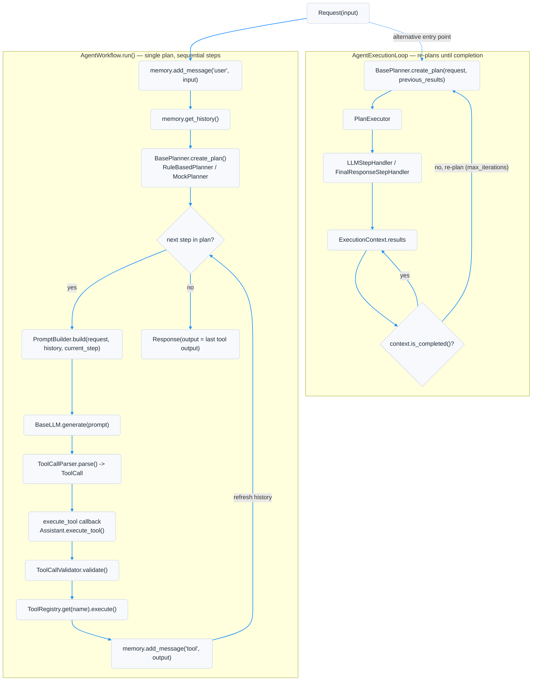

# Agent Workflow

Agent components exist in the core library but are **not exposed through the HTTP API**
in this release. Two independent execution paths are implemented.

```mermaid
flowchart TB
    REQ["Request(input)"]

    subgraph AW["AgentWorkflow.run() — single plan, sequential steps"]
        M1["memory.add_message('user', input)"]
        H["memory.get_history()"]
        P["BasePlanner.create_plan()<br/>RuleBasedPlanner / MockPlanner"]
        LOOP{"next step in plan?"}
        PR["PromptBuilder.build(request, history, current_step)"]
        GEN["BaseLLM.generate(prompt)"]
        PARSE["ToolCallParser.parse() -> ToolCall"]
        EXEC["execute_tool callback<br/>Assistant.execute_tool()"]
        VAL["ToolCallValidator.validate()"]
        REG["ToolRegistry.get(name).execute()"]
        M2["memory.add_message('tool', output)"]
        OUT["Response(output = last tool output)"]
    end

    subgraph EL["AgentExecutionLoop — re-plans until completion"]
        PL2["BasePlanner.create_plan(request, previous_results)"]
        PE["PlanExecutor"]
        HDL["LLMStepHandler / FinalResponseStepHandler"]
        CTX["ExecutionContext.results"]
        DONE{"context.is_completed()?"}
    end

    REQ --> M1 --> H --> P --> LOOP
    LOOP -->|"yes"| PR --> GEN --> PARSE --> EXEC
    EXEC --> VAL --> REG --> M2
    M2 -->|"refresh history"| LOOP
    LOOP -->|"no"| OUT

    REQ -.->|"alternative entry point"| PL2
    PL2 --> PE --> HDL --> CTX --> DONE
    DONE -->|"no, re-plan (max_iterations)"| PL2
    DONE -->|"yes"| CTX

    linkStyle default stroke:#1E90FF,stroke-width:1.6px
    classDef box fill:#F7F9FC,stroke:#C9D4E3,stroke-width:1px,rx:6,ry:6,color:#1F2937
    class REQ,M1,H,P,LOOP,PR,GEN,PARSE,EXEC,VAL,REG,M2,OUT,PL2,PE,HDL,CTX,DONE box
```
