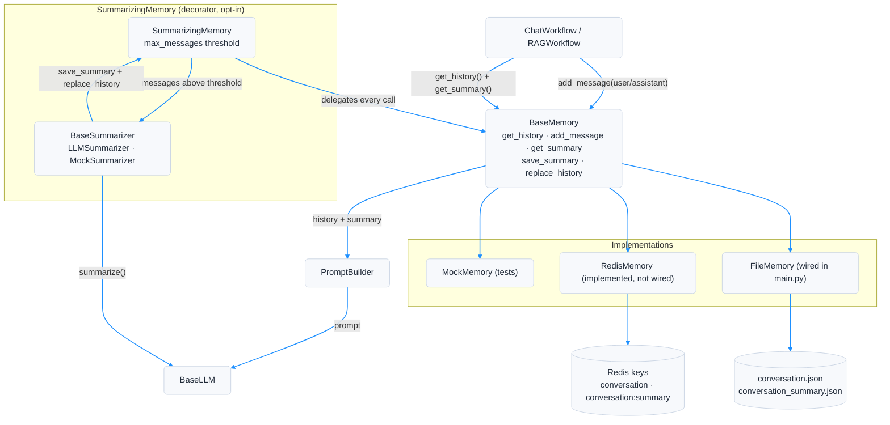

# Memory Architecture

```mermaid
flowchart TB
    WF["ChatWorkflow / RAGWorkflow"]
    BM["BaseMemory<br/>get_history · add_message · get_summary<br/>save_summary · replace_history"]

    subgraph IMPL["Implementations"]
        FM["FileMemory (wired in main.py)"]
        RM["RedisMemory (implemented, not wired)"]
        MM["MockMemory (tests)"]
    end

    subgraph DEC["SummarizingMemory (decorator, opt-in)"]
        SM["SummarizingMemory<br/>max_messages threshold"]
        SUM["BaseSummarizer<br/>LLMSummarizer · MockSummarizer"]
    end

    FS[("conversation.json<br/>conversation_summary.json")]
    RS[("Redis keys<br/>conversation · conversation:summary")]
    LLM["BaseLLM"]
    PB["PromptBuilder"]

    WF -->|"add_message(user/assistant)"| BM
    WF -->|"get_history() + get_summary()"| BM
    BM --> FM
    BM --> RM
    BM --> MM
    SM -->|"delegates every call"| BM
    SM -->|"messages above threshold"| SUM
    SUM -->|"summarize()"| LLM
    SUM -->|"save_summary + replace_history"| SM
    FM --> FS
    RM --> RS
    BM -->|"history + summary"| PB
    PB -->|"prompt"| LLM

    linkStyle default stroke:#1E90FF,stroke-width:1.6px
    classDef box fill:#F7F9FC,stroke:#C9D4E3,stroke-width:1px,rx:6,ry:6,color:#1F2937
    class WF,BM,FM,RM,MM,SM,SUM,FS,RS,LLM,PB box
```
