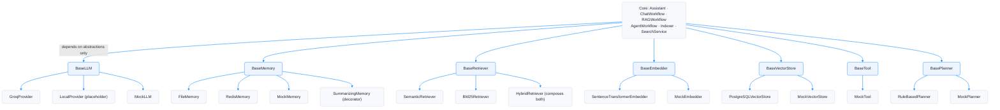

# Provider Independence / Abstraction Architecture

```mermaid
flowchart TB
    CORE["Core: Assistant · ChatWorkflow · RAGWorkflow<br/>AgentWorkflow · Indexer · SearchService"]

    LLM["BaseLLM"]
    MEMI["BaseMemory"]
    RET["BaseRetriever"]
    EMBI["BaseEmbedder"]
    VSI["BaseVectorStore"]
    TOOLI["BaseTool"]
    PLANI["BasePlanner"]

    G["GroqProvider"]
    LP["LocalProvider (placeholder)"]
    MK["MockLLM"]

    FM["FileMemory"]
    RM["RedisMemory"]
    MM["MockMemory"]
    SMD["SummarizingMemory (decorator)"]

    SR["SemanticRetriever"]
    BR["BM25Retriever"]
    HR["HybridRetriever (composes both)"]

    STE["SentenceTransformerEmbedder"]
    ME["MockEmbedder"]

    PGS["PostgreSQLVectorStore"]
    MVS["MockVectorStore"]

    MT["MockTool"]
    RBP["RuleBasedPlanner"]
    MP["MockPlanner"]

    CORE -->|"depends on abstractions only"| LLM
    CORE --> MEMI
    CORE --> RET
    CORE --> EMBI
    CORE --> VSI
    CORE --> TOOLI
    CORE --> PLANI

    LLM --> G
    LLM --> LP
    LLM --> MK
    MEMI --> FM
    MEMI --> RM
    MEMI --> MM
    MEMI --> SMD
    RET --> SR
    RET --> BR
    RET --> HR
    EMBI --> STE
    EMBI --> ME
    VSI --> PGS
    VSI --> MVS
    TOOLI --> MT
    PLANI --> RBP
    PLANI --> MP

    linkStyle default stroke:#1E90FF,stroke-width:1.6px
    classDef box fill:#F7F9FC,stroke:#C9D4E3,stroke-width:1px,rx:6,ry:6,color:#1F2937
    classDef iface fill:#EEF4FF,stroke:#1E90FF,stroke-width:1.2px,rx:6,ry:6,color:#1F2937
    class CORE,G,LP,MK,FM,RM,MM,SMD,SR,BR,HR,STE,ME,PGS,MVS,MT,RBP,MP box
    class LLM,MEMI,RET,EMBI,VSI,TOOLI,PLANI iface
```

`create_llm()` selects the provider from `LLM_PROVIDER`; `LocalProvider` raises
`NotImplementedError` and exists to reserve the extension point.
