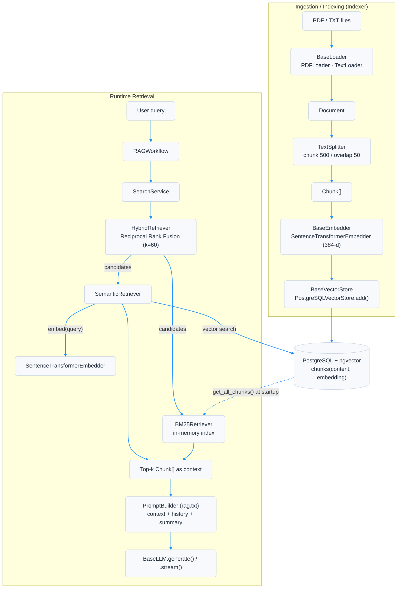

# RAG Pipeline

Ingestion is offline (`Indexer`); retrieval happens per request.

```mermaid
flowchart TB
    subgraph ING["Ingestion / Indexing (Indexer)"]
        DOC["PDF / TXT files"]
        LOAD["BaseLoader<br/>PDFLoader · TextLoader"]
        DOCM["Document"]
        SPLIT["TextSplitter<br/>chunk 500 / overlap 50"]
        CH["Chunk[]"]
        EMB1["BaseEmbedder<br/>SentenceTransformerEmbedder (384-d)"]
        VS["BaseVectorStore<br/>PostgreSQLVectorStore.add()"]
    end

    PG[("PostgreSQL + pgvector<br/>chunks(content, embedding)")]

    subgraph RUN["Runtime Retrieval"]
        Q["User query"]
        RW["RAGWorkflow"]
        SS["SearchService"]
        HR["HybridRetriever<br/>Reciprocal Rank Fusion (k=60)"]
        SR["SemanticRetriever"]
        BM["BM25Retriever<br/>in-memory index"]
        EMB2["SentenceTransformerEmbedder"]
        TOP["Top-k Chunk[] as context"]
        PB["PromptBuilder (rag.txt)<br/>context + history + summary"]
        LLM["BaseLLM.generate() / .stream()"]
    end

    DOC --> LOAD --> DOCM --> SPLIT --> CH --> EMB1 --> VS --> PG
    Q --> RW --> SS --> HR
    HR -->|"candidates"| SR
    HR -->|"candidates"| BM
    SR -->|"embed(query)"| EMB2
    SR -->|"vector search"| PG
    PG -.->|"get_all_chunks() at startup"| BM
    SR --> TOP
    BM --> TOP
    TOP --> PB --> LLM

    linkStyle default stroke:#1E90FF,stroke-width:1.6px
    classDef box fill:#F7F9FC,stroke:#C9D4E3,stroke-width:1px,rx:6,ry:6,color:#1F2937
    class DOC,LOAD,DOCM,SPLIT,CH,EMB1,VS,PG,Q,RW,SS,HR,SR,BM,EMB2,TOP,PB,LLM box
```
