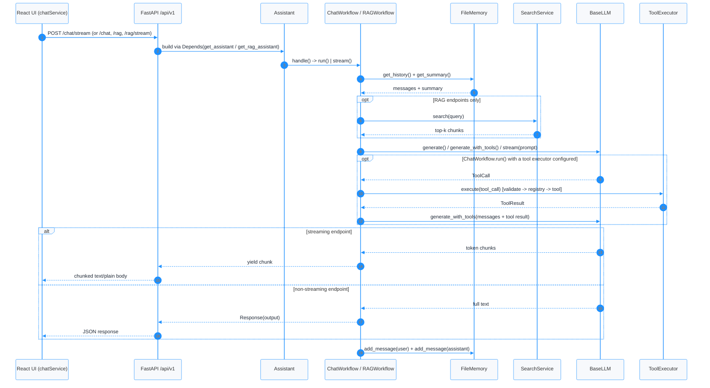

# Request Lifecycle

Streaming endpoints return a chunked `text/plain` body (not SSE); the browser reads it
with `fetch` + `ReadableStream`.

```mermaid
%%{init: {"theme":"base","themeVariables":{"signalColor":"#1E90FF","signalTextColor":"#1F2937","lineColor":"#1E90FF","actorBorder":"#1E90FF","actorBkg":"#F7F9FC","activationBorderColor":"#1E90FF","noteBkgColor":"#EEF4FF","noteBorderColor":"#1E90FF"}}}%%
sequenceDiagram
    autonumber
    participant UI as React UI (chatService)
    participant API as FastAPI /api/v1
    participant A as Assistant
    participant W as ChatWorkflow / RAGWorkflow
    participant MEM as FileMemory
    participant S as SearchService
    participant L as BaseLLM
    participant T as ToolExecutor

    UI->>API: POST /chat/stream (or /chat, /rag, /rag/stream)
    API->>A: build via Depends(get_assistant / get_rag_assistant)
    A->>W: handle() -> run()  |  stream()
    W->>MEM: get_history() + get_summary()
    MEM-->>W: messages + summary

    opt RAG endpoints only
        W->>S: search(query)
        S-->>W: top-k chunks
    end

    W->>L: generate() / generate_with_tools() / stream(prompt)

    opt ChatWorkflow.run() with a tool executor configured
        L-->>W: ToolCall
        W->>T: execute(tool_call) [validate -> registry -> tool]
        T-->>W: ToolResult
        W->>L: generate_with_tools(messages + tool result)
    end

    alt streaming endpoint
        L-->>W: token chunks
        W-->>API: yield chunk
        API-->>UI: chunked text/plain body
    else non-streaming endpoint
        L-->>W: full text
        W-->>API: Response(output)
        API-->>UI: JSON response
    end

    W->>MEM: add_message(user) + add_message(assistant)
```
