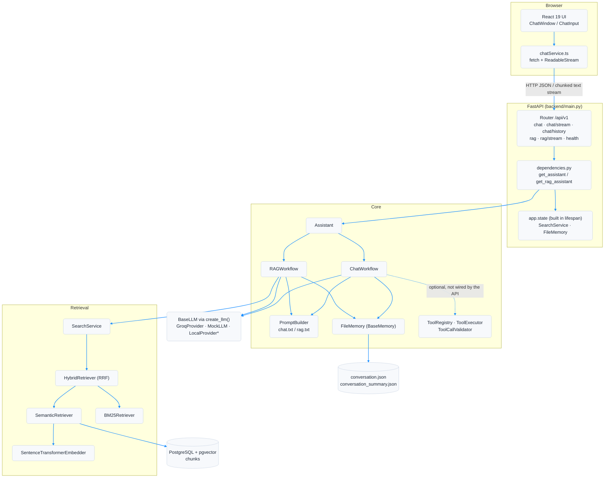

# System Architecture

Deployment and component overview of the stack started by `docker compose up`.

`*` `LocalProvider` is a placeholder and raises `NotImplementedError`.
Tool execution is implemented but the API constructs `ChatWorkflow` without a
`ToolExecutor`, so tools are library-level only in this release.
